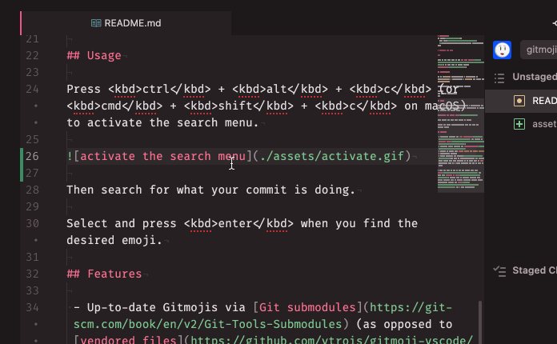

# Gitmoji-atom
<a href="https://gitmoji.dev">
  
</a>

> Gitmojis for Atom

---

This is the Atom port of the [VS Code plugin](https://marketplace.visualstudio.com/items?itemName=Vtrois.gitmoji-vscode). No more need to search through [gitmoji.dev](https://gitmoji.dev/)!

## Installation

Go to `Settings` (<kbd>cmd</kbd> + <kbd>,</kbd> or <kbd>ctrl</kbd> + <kbd>,</kbd>) > `Install` and search for `gitmoji-atom`.

Alternatively, run the following command:

```bash
apm install gitmoji-atom
```

## Usage

Press <kbd>ctrl</kbd> + <kbd>alt</kbd> + <kbd>c</kbd> (or <kbd>cmd</kbd> + <kbd>shift</kbd> + <kbd>c</kbd> on macOS) to activate the search menu.



Then search for what your commit is doing.


Select and press <kbd>enter</kbd> when you find the desired emoji.

## Features

 - Up-to-date Gitmojis via [Git submodules](https://git-scm.com/book/en/v2/Git-Tools-Submodules) (as opposed to [vendored files](https://github.com/vtrois/gitmoji-vscode/blob/main/src/gitmoji/gitmoji.ts))
 - Intuitive search dropdown via [atom-select-list](https://github.com/atom/atom-select-list)
 - Ability to insert text **into Atom's git commit editor**
 - Customizable settings
 - ~~Fast searching via [Zadeh](https://github.com/atom-community/zadeh)~~ This is disabled/commented out because there aren't that many Gitmojis as of right now. It *is* implemented but, as I said, commented out due to lack of need.

I hope you like it ❤️! If you do, please star this [repo](https://github.com/ThatXliner/gitmoji-atom) and star this [package on Atom](https://atom.io/packages/gitmoji-atom). That'll give me accurate feedback that people actually like my package (download numbers aren't particularly useful. See [here](https://packaging.python.org/guides/analyzing-pypi-package-downloads/#background) for a good explanation)
